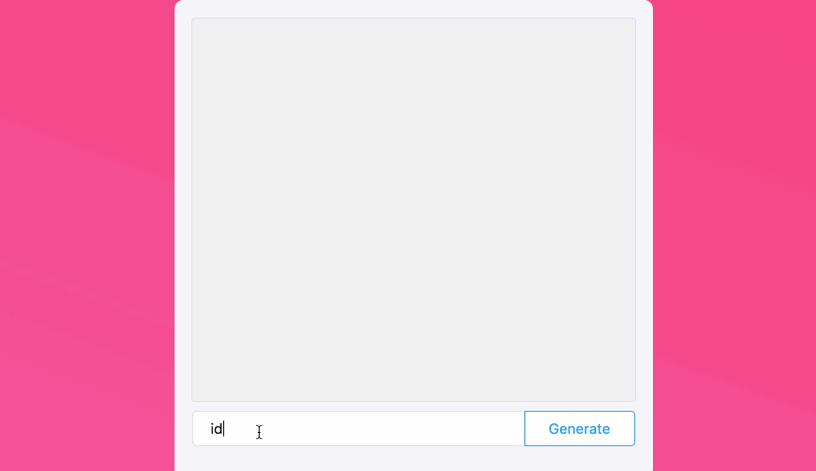

## Welcome to _IDENTICON™️_ AKA _GRAVATAR™️_

---

We are going to be building out an Identicon generator using JavaScript and some DOM manipulation.

---

An Identicon is a visual representation of a hash value that serves to identify a user of a computer system as a form of avatar while protecting the users' privacy. You can read more about [Identicons here](https://en.wikipedia.org/wiki/Identicon).

GitHub automatically generates one when you sign up and have not uploaded a profile photo yet.

---

The completed application looks like this:

---

When a user inputs their name, the Identicon should dynamically produce an avatar for them. We've provided you with some starter code and will walk through the desired output of each function.

---

Let's start by breaking this down into some distinct steps:

# identicon()

A user will type something into the input field. Let's start by grabbing that data.

---

Take a look at `index.js`. Inside the `DOMContentLoaded` callback function, find the form in the HTML and save it as a variable. Open up `index.html` and find out if the form has an `id` tag that you can use to find it in your JavaScript code.

Add an event listener to the form for a submit action. We'll add the following code

---

Good luck!
